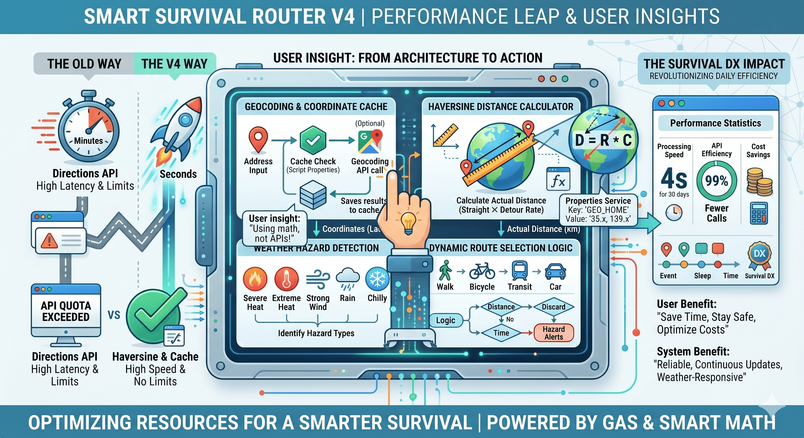

# 🌩️ Smart Survival Router V4

[](https://developers.google.com/apps-script)
[](https://note.com/masa_cloud)



A Google Apps Script (GAS) that detects weather hazards (severe heat, strong wind, rain) and automatically calculates the optimal transportation mode and travel time to your scheduled events, adding them directly to your Google Calendar.

V4 breaks free from Google Maps Directions API dependencies by implementing the **Haversine formula** and **latitude/longitude caching**. This completely bypasses API quota limits, evolving into a blazing-fast script that processes 30 days of schedules in just a few seconds.

## ✨ Features

- **🌦️ Weather Hazard Integration**: Reads alerts like "Severe Heat", "Windy", and "Rain" from a weather calendar to automatically select the safest transportation mode (Car, Train/Bus, Walk, Bicycle) to protect your life and health.
- **🚀 Blazing Fast & API Quota Evasion**: Eliminates heavy Directions API calls. Instead, it calculates the estimated travel time using the Haversine formula (straight-line distance) multiplied by a detour rate (1.4x).
- **💾 Coordinate Caching**: Saves geocoded latitude and longitude data into `PropertiesService` as a permanent cache, completely removing external API communication bottlenecks for recurring locations.
- **⚡ Ultra-Lightweight Processing**: Scans and processes up to 30 days of schedules in about 4 seconds. Easily runs on a high-frequency "every 5 minutes" trigger without exceeding the free GAS account limits (90 mins/day).
- **💻 Smart Exclusions**: Automatically skips travel calculations for events containing keywords like "zoom", "online", or "meet" in the location field.

## 🏗️ Architecture

1. **Event Extraction**: Retrieves calendar events that have a defined Location.
2. **Hazard Detection**: Checks for weather alerts within 30 minutes before and after the scheduled time.
3. **Distance Calculation (Haversine)**: Calculates the straight-line distance from the origin to the destination coordinates (retrieved from the cache), and divides it by the speed of each transportation mode.
4. **Calendar Sync**: Automatically registers the departure time, arrival time, and estimated distance on your calendar with titles like "[Train/Bus] Travel: Meeting Name".

## 🛠️ Setup

### 1. Create a GAS Project
Create a new Google Apps Script project from Google Calendar or Google Drive.

### 2. Paste the Code
Paste the code from this repository into your `Code.gs` file.

### 3. Update Configuration Variables
Adjust the constants at the top of the code (Section 1) to match your environment.

```javascript
const HOME_ADDRESS = 'Your Home/Base Address Here'; // e.g., '123 Main St, City, Country'
const BUFFER_MINUTES = 5; // Arrival buffer time (minutes)
const WEATHER_CALENDAR_ID = 'your_weather_calendar_id@group.calendar.google.com';
const DAYS_TO_CHECK = 30; // Number of days ahead to calculate
```

4. Set Up the Trigger
To respond to weather hazard changes in real-time, set up a trigger. Click the "Clock icon (Triggers)" on the left menu of the GAS editor and add the following:

Choose which function to run: automateHazardAwareTravelSchedule

Select event source: Time-driven

Select type of time based trigger: Minutes timer

Select minute interval: Every 5 minutes

(Note: Thanks to the API-evading architecture, this runs perfectly fine every 5 minutes even on a free account.)

⚠️ Notes
This script requires a dedicated Google Calendar (WEATHER_CALENDAR_ID) that pre-imports weather alerts/forecasts.

Distance calculations are "estimates" based on the Haversine formula. Actual travel times may vary depending on real-world terrain and road conditions (e.g., mountain roads, bridges).

🧑‍💻 Author
Hack Ninja (Masaaki Itoh)

Note: https://note.com/masa_cloud

YouTube: Hack Ninja

GitHub: Masaaki-jp

This project is developed based on the "Survival DX" philosophy: combining low-cost hardware and cloud resources to produce high-performance results.
